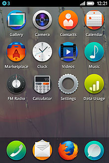

% JavaScript: Introduction
% fmdkdd
% Mines Nantes ~ October 2014

# Why JavaScript?

## “New generation languages”
- 1972: C
- 1990: Haskell
- 1991: Python
- 1995: JavaScript, Java, PHP
- 2000: C#
- 2004: Scala

### Release dates are irrelevant

## Haskell != JS != Scala
- Radically different from Haskell and Scala
- Dynamically typed
- Prototype-based, or object-based, but not OO
- Not from the same communities: Haskell, Scala from PL researchers, JS from industry

## “Programming the web with JavaScript”
- Web browsers are ubiquitous
- JavaScript is built-in
- JavaScript is in the right place at the right time

### If you build web applications, you need to understand JavaScript

## JavaScript is everywhere
- [Most used](http://langpop.corger.nl/) language on Github
- Used for desktop apps, mobile apps, games, phones, ISP boxes, ...

## So, why JavaScript?
- Different from Haskell and Scala
- Relevant in today’s marketplace

# Common misconceptions

## “JavaScript is horrible”
- Thought-terminating cliché
- There are no bad languages, only bad programmers
- Some parts of the language are badly designed
- Just don’t use them

## JavaScript != HTML APIs
- JavaScript is the language
- AJAX, canvas, DOM, audio are part of the browser
- APIs can be thought of as the “javax.*” packages
- No standard function for printing to output (!)

## JavaScript does not need a browser
- JavaScript is a language
- Most browsers have an interpreter, some don’t
- Interps outside browsers exist (Rhino, Nashorn, V8)
- NodeJS is system-specific APIs + V8

# Content of the course

## JS = Functions + Objects + Prototypes
- Functions are first-class values
- Objects as a multi-purpose data structure
- Prototypes for behavior sharing

### Three sessions, three topics

- Expressive combo
- No previous knowledge of JavaScript required (but every bit helps)

## Tools of the trade
- A browser for executing (preferably Firefox, but Chrome ok)
- A text editor for writing (preferably Emacs, but * is ok)
- A linter can be helpful, I recommend [ESLint](http://eslint.org/)
  with the defaults on campus (best integrated with your editor)
- Documentation: [Devdocs](http://devdocs.io/), [caniuse](http://caniuse.com/)

## Won’t cover
- Web frameworks ([React](https://facebook.github.io/react/), [Angular](http://angularjs.org/), [Backbone](http://backbonejs.org/))
- Libraries ([jQuery](http://jquery.com/), [lodash](http://lodash.com/))
- Browser differences ([Kangax’s compatibility table](https://kangax.github.io/compat-table/non-standard/))
- JS variants ([TypeScript](http://www.typescriptlang.org/), [CoffeeScript](http://coffeescript.org/))

### But if you want to get serious, you should know them

## Recommended readings
### Beginner
- [Mozilla’s JavaScript Guide](https://developer.mozilla.org/en-US/docs/Web/JavaScript/Guide)
- [Eloquent JavaScript](http://eloquentjavascript.net/)
- [JavaScript Garden](https://bonsaiden.github.io/JavaScript-Garden/)

### Intermediate
- [Functional JavaScript](http://www.functionaljavascript.com/)
- [Effective JavaScript](http://effectivejs.com/)
